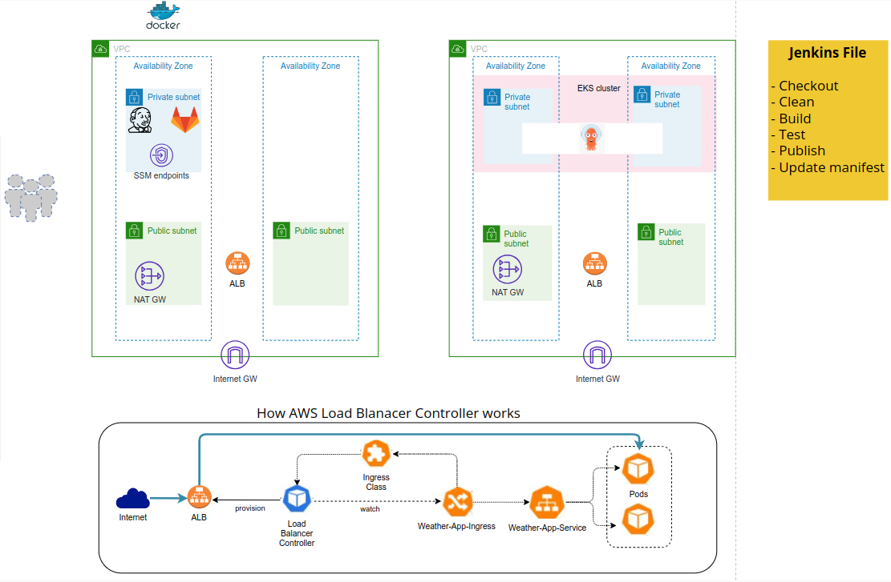

# Jenkins CI/CD Pipeline to EKS Cluster

Automate the CI/CD pipeline for a Flask application and deploy it on an Amazon EKS (Elastic Kubernetes Service) cluster using Argo CD. This project uses Jenkins, GitLab, Terraform, and AWS services to create a fully automated pipeline for continuous integration and continuous deployment.

  
*Architecture overview of CI/CD pipeline components within Development and Production VPCs.*

---

## Table of Contents

- [Architecture Overview](#architecture-overview)
- [Prerequisites](#prerequisites)
- [Setup](#setup)
  - [Infrastructure Setup](#infrastructure-setup)
  - [ArgoCD Setup](#argocd-setup)
  - [Ingress Setup](#ingress-setup)
- [Pipeline Workflow](#pipeline-workflow)
- [Security Best Practices](#security-best-practices)

---

## Architecture Overview

### Development VPC
- **Private Subnets**: Jenkins and GitLab instances are hosted in private subnets for security.
- **SSM Endpoints**: Instance management is achieved via AWS SSM (Session Manager) endpoints, removing the need for direct SSH access.
- **NAT Gateway**: Provides outbound internet access to instances without exposing them to the public internet.
- **Load Balancer**: A load balancer is implemented for controlled access to Jenkins and GitLab tools.

### Production VPC
- **Private Subnets for EKS**: EKS worker nodes are deployed across two private subnets in different Availability Zones for redundancy.
- **Control Plane Access**: EKS worker nodes allow inbound access from the EKS control plane’s security group only, following least privilege principles.
- **IAM Authentication for API Access**: Secure access to the EKS API server is managed via AWS CLI using IAM-based authentication.
- **Automatic Application Exposure**: The application is exposed through an Application Load Balancer (ALB), which is automatically provisioned by the AWS Load Balancer Controller.

---

## Prerequisites

- **AWS Account**: An AWS account with permissions for IAM, VPC, EC2, and EKS resources.
- **AMI Integration**: Preconfigured AMIs for Jenkins and GitLab servers.
- **Required CLI Tools**:
  - [Terraform](https://www.terraform.io/)
  - [kubectl](https://kubernetes.io/docs/tasks/tools/)
  - [AWS CLI](https://aws.amazon.com/cli/)

---

## Setup

### Infrastructure Setup
The infrastructure for this project is managed using **Terraform**. Follow these steps to set up the infrastructure:

1. Clone this repository.
2. Navigate to the `terraform` directory.
3. Update `variables.tf` with your AWS configuration.
4. Run the following commands:
   ```bash
   terraform init
   terraform apply
   ```
   This will set up VPCs, subnets, EKS cluster, and necessary IAM roles and policies.

### ArgoCD Setup
After the infrastructure is provisioned with Terraform, proceed with setting up ArgoCD:

1. Install ArgoCD in the EKS cluster.
2. Configure ArgoCD to sync with the Git repository containing the Kubernetes manifests.
3. ArgoCD will watch for changes in Git and automatically apply updates to the EKS cluster.

### Ingress Setup
Ingress must be applied to direct traffic to the application's serviec in k8s

---

## Pipeline Workflow

The CI/CD pipeline is managed by Jenkins and configured with the following stages:

1. **Checkout**: Pull the latest code from the GitLab repository.
2. **Clean**: Clean up any previous build artifacts.
3. **Build**: Build the Docker image for the Flask application.
4. **Test**: Run automated tests to ensure code quality.
5. **Publish**: Push the Docker image to a container registry.
6. **Update Manifest**: Update the Kubernetes manifest in the Git repository. This triggers ArgoCD to deploy the latest changes to the EKS cluster.

Each stage is defined in the `Jenkinsfile`, ensuring an automated flow from code commit to deployment.

---

## Security Best Practices

This project follows several security best practices to ensure a secure and robust CI/CD pipeline:

- **Environment Isolation**: Development and production environments are isolated at the VPC level.
- **Private Subnet Deployment**: All instances, including Jenkins, GitLab, and EKS worker nodes, are deployed in private subnets to limit public exposure.
- **Least Privilege Security Groups**: Security groups are configured with minimal permissions to follow the principle of least privilege.
- **SSM for Access Management**: Use of AWS Systems Manager (SSM) for accessing instances, avoiding the need for inbound SSH access.
- **Load Balancer Controller**: Utilizes the AWS Load Balancer Controller for seamless ALB provisioning and secure integration with AWS services using IAM roles and RBAC.
- **GitOps Model with ArgoCD**: ArgoCD is configured to sync from the Git repository, making Git the single source of truth. This "pull" model ensures that only approved changes are deployed.

---

## Conclusion

This Jenkins CI/CD pipeline for EKS provides an automated, secure, and scalable solution for deploying and managing applications in Kubernetes. By integrating Jenkins, GitLab, Terraform, and ArgoCD, this setup enables a streamlined DevOps workflow that enhances productivity and operational efficiency.

For further details, refer to the architecture diagram at the top of this README to understand the overall flow and connections between components in the pipeline.

--- 


